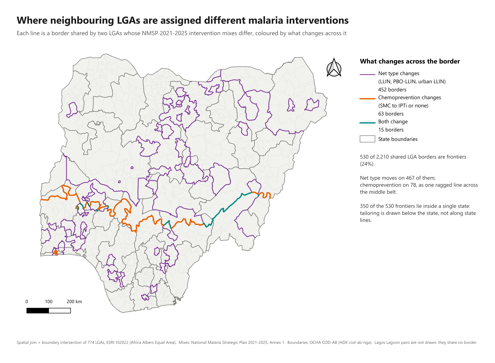

# Nigeria Malaria SNT Spatial Intelligence System

A GeoDev Lab Africa Cohort 1 project mapping the geography of malaria
intervention assignments under subnational tailoring (SNT) in Nigeria.
**Month 1 is complete:** four weekly tasks, one question, one answer.

## The answer

> **Question (Week 1):** Where in Nigeria does subnational tailoring actually
> assign different malaria intervention mixes to neighbouring LGAs?

**Answer (Week 4):** on **530 of the 2,210 borders** between neighbouring LGAs
(24%), and mostly **inside states, not along state lines**.

- **Two-thirds of the frontiers (350 of 530) run through the middle of a
  state.** Kano alone has 47. Tailoring really is drawn below the state, so a
  single state programme has to deliver different packages to LGAs that sit
  next to each other.
- **The seasonal malaria chemoprevention line is one ragged frontier across
  the middle belt.** SMC in the north meets IPTi in the south along a line from
  the Benin border through Oyo, Kwara, Kogi, Benue and Taraba to Adamawa at the
  Cameroon border. 50 of its 66 borders are inside a state.
- **Most frontiers are about nets, not drugs.** 452 change the net type
  (standard, PBO or urban LLINs), 63 change the chemoprevention, 15 change both.
- **415 of the 774 LGAs sit on at least one frontier.** Only **11 states** get
  one mix throughout, and they are exactly the 11 with no internal frontier.



*Map: [`qgis/mix_frontiers.png`](qgis/mix_frontiers.png). Data:
[`data/processed/nga_snt_frontiers.gpkg`](data/processed/nga_snt_frontiers.gpkg),
layer `lga_borders`, one line per shared border. How it was computed and
checked: [`docs/04-spatial-analysis.md`](docs/04-spatial-analysis.md).*

One ruling limits this answer. **Lagos Lagoon belongs to no LGA** in the
official boundaries, so four pairs of Lagos LGAs facing each other across the
water are not counted as neighbours. Counting them would give 534 frontiers.

## Month 1, week by week

Every week's work is linked here, with the commits that built it.

| Week | Task | The note | What it produced | Commits |
|---|---|---|---|---|
| **1** | Project brief: question, study area, a source link for every dataset | [`docs/01-project-brief.md`](docs/01-project-brief.md) · [data needed, with links](docs/01-project-brief.md#the-data-i-need) | [`nmsp_2021_2025_lga_intervention_mix.csv`](data/processed/nmsp_2021_2025_lga_intervention_mix.csv): 774 LGAs from the NMSP annex · [`scripts/extract_nmsp_annex1.py`](scripts/extract_nmsp_annex1.py) · source register [`docs/data-sources.md`](docs/data-sources.md) · test log [`docs/data-feasibility.md`](docs/data-feasibility.md) | [`8c72b92`](https://github.com/GentlePrince-ng/geodevproject/commit/8c72b92) [`c9f6d62`](https://github.com/GentlePrince-ng/geodevproject/commit/c9f6d62) [`af281c7`](https://github.com/GentlePrince-ng/geodevproject/commit/af281c7) |
| **2** | Data notes: what was downloaded and opened in QGIS | [`docs/02-data-notes.md`](docs/02-data-notes.md) | [`nga_cod_admin.gpkg`](data/processed/nga_cod_admin.gpkg): boundaries + mixes + population, 774/774 joined · [`nmsp_lga_name_crosswalk.csv`](data/processed/nmsp_lga_name_crosswalk.csv) · QGIS project [`qgis/snt.qgz`](qgis/snt.qgz) · map [`qgis/three_axes.png`](qgis/three_axes.png) | [`1d9b4a1`](https://github.com/GentlePrince-ng/geodevproject/commit/1d9b4a1) [`25f5048`](https://github.com/GentlePrince-ng/geodevproject/commit/25f5048) [`ef807bf`](https://github.com/GentlePrince-ng/geodevproject/commit/ef807bf) |
| **3** | Prepared data and the quality checks run | [`docs/03-data-preparation.md`](docs/03-data-preparation.md) · [the five checks](docs/03-data-preparation.md#3-the-five-quality-checks) | **Analysis-ready** [`nga_snt_analysis_ready.gpkg`](data/processed/nga_snt_analysis_ready.gpkg) (ESRI:102022) · check results [`qc_report.json`](data/processed/qc_report.json) · [`scripts/prepare_analysis_ready.py`](scripts/prepare_analysis_ready.py) · figure [`coverage_gap_lagos_lagoon.png`](qgis/coverage_gap_lagos_lagoon.png) | [`d655482`](https://github.com/GentlePrince-ng/geodevproject/commit/d655482) [`cef5966`](https://github.com/GentlePrince-ng/geodevproject/commit/cef5966) |
| **4** | Analysis, the map image, and the month summary | [`docs/04-spatial-analysis.md`](docs/04-spatial-analysis.md) · **[`docs/month-1-summary.md`](docs/month-1-summary.md)** | Map **[`qgis/mix_frontiers.png`](qgis/mix_frontiers.png)** · [`nga_snt_frontiers.gpkg`](data/processed/nga_snt_frontiers.gpkg) · checks [`frontier_checks.json`](data/processed/frontier_checks.json) · [`scripts/find_mix_frontiers.py`](scripts/find_mix_frontiers.py) · QGIS project [`qgis/frontiers.qgz`](qgis/frontiers.qgz) | [`24d44a5`](https://github.com/GentlePrince-ng/geodevproject/commit/24d44a5) (expectations, committed before the run) [`8ede1b0`](https://github.com/GentlePrince-ng/geodevproject/commit/8ede1b0) [`50cf6bf`](https://github.com/GentlePrince-ng/geodevproject/commit/50cf6bf) |

## How the four weeks connect

Each week's output is the next week's input, and each week made a decision
that the later weeks depend on.

1. **Week 1 set the question and got the hardest dataset first.** The
   intervention mixes exist only as a 16-page table in Annex 1 of the National
   Malaria Strategic Plan 2021–2025. Extracting it (774/774 rows) came first,
   because nothing else matters without it. The 2025 malaria survey reports
   only at state level, which ruled out a burden question at LGA level and
   narrowed the brief to the geography of the mixes themselves.
2. **Week 2 put those 774 rows on a map.** The NMSP table has names but no
   codes, so the risk was the join to the official LGA boundaries. It holds
   774/774 (746 exact, 12 by suffix, 16 by a hand-checked spelling table).
   Styling the map showed that the seven mixes vary on only **two axes**, net
   type and chemoprevention. Week 4 counts frontiers on those same two axes.
3. **Week 3 made the layer fit to measure.** The data were reprojected to
   Africa Albers Equal Area, because Nigeria spans three UTM zones, then
   clipped and checked five ways. The coverage check found the **Lagos Lagoon
   gap**, a hole that decides which LGAs count as neighbours. Week 3 flagged
   it and Week 4 ruled on it.
4. **Week 4 answered the question.** It joined the analysis-ready layer to
   itself to find neighbours, then intersected their boundaries to get each
   shared border. The expected results were committed *before* the run
   ([`24d44a5`](https://github.com/GentlePrince-ng/geodevproject/commit/24d44a5)).
   The counts came out as predicted but the pattern did not: I expected
   frontiers to follow state lines, and two-thirds run inside states.

**What comes next:** do the frontiers follow real differences in malaria
burden (Question 2)? That needs burden data below state level. See
[what data I still need](docs/month-1-summary.md#what-data-i-still-need).

## The data

Four datasets, each with its source link, in
[`docs/01-project-brief.md`](docs/01-project-brief.md#the-data-i-need):

| # | Dataset | Source |
|---|---|---|
| 1 | NMSP 2021–2025 LGA intervention mix | [mesamalaria.org](https://mesamalaria.org/wp-content/uploads/2024/07/NATIONAL-MALARIA-STRATEGIC-PLAN-Nigeria-2021-2025-Final.pdf) |
| 2 | Nigeria LGA boundaries (admin 2) | [HDX `cod-ab-nga`](https://data.humdata.org/dataset/cod-ab-nga) |
| 3 | Nigeria state boundaries (admin 1) | [HDX `cod-ab-nga`](https://data.humdata.org/dataset/cod-ab-nga) |
| 4 | Nigeria subnational population | [HDX `cod-ps-nga`](https://data.humdata.org/dataset/cod-ps-nga) |

**All four are now downloaded, opened in QGIS and joined into one GeoPackage**
(`data/processed/nga_cod_admin.gpkg`, committed). Feature counts, key columns,
geometry types and every gap found are written up in
[`docs/02-data-notes.md`](docs/02-data-notes.md).

The headline: the NMSP table carries no PCODEs, only names, and **774 of 774
LGAs still reach a PCODE** — 746 by exact match, 12 by stripping the NMSP's
numeric disambiguation suffixes, 16 by a hand-checked spelling table. Nothing
unmatched, no two rows landing on the same polygon.

## Project

Nigeria assigns malaria intervention packages to each of its 774 Local
Government Areas on the basis of epidemiological stratification. Those
assignments exist only as an alphabetical table in a strategic-plan annex, so
their geography has never been laid out. This project maps it, then builds
outward from there.

The goal is a reproducible geospatial intelligence system, not a static map.

## What is in the repository so far

```
├── README.md                         This file — the repository front page
├── docs/
│   ├── 01-project-brief.md           Week 1: question, study area, data, what gets built
│   ├── 02-data-notes.md              Week 2: every dataset, its columns, its gaps
│   ├── 03-data-preparation.md        Week 3: CRS, clip, five quality checks, problems
│   ├── 04-spatial-analysis.md        Week 4: spatial join + intersection, four checks
│   ├── month-1-summary.md            Month 1 summary
│   ├── data-sources.md               Source register for every dataset claimed
│   └── data-feasibility.md           Log of what was actually tested and found
├── scripts/
│   ├── extract_nmsp_annex1.py        NMSP 2021–2025 Annex 1 → LGA intervention mix
│   ├── extract_nmis2025_parasitaemia.py   NMIS 2025 → state-level parasitaemia
│   ├── download_cod_data.py          HDX boundaries + population, with checksums
│   ├── build_admin_gpkg.py           Joins all three into the project GeoPackage
│   ├── prepare_analysis_ready.py     Week 3: reproject, clip, five quality checks
│   ├── plot_lagoon_gap.py            Renders the one coverage gap QC 4 found
│   ├── find_mix_frontiers.py         Week 4: which LGAs touch, and where the mix changes
│   ├── build_frontier_map.py         Week 4 map (needs the QGIS Python)
│   ├── make_qml_styles.py            Writes the three QGIS styles
│   ├── build_qgis_project.py         Rebuilds qgis/snt.qgz (needs the QGIS Python)
│   └── build_qgis_layout.py          Adds the three-panel layout (needs the QGIS Python)
├── qgis/
│   ├── snt.qgz                       QGIS project (Weeks 2-3)
│   ├── frontiers.qgz                 QGIS project (Week 4), layout "Mix frontiers"
│   ├── mix_frontiers.png             Week 4 map: the 530 mix frontiers
│   ├── adm2_*.qml                    Three layer styles: the full mix, and each axis alone
│   ├── three_axes.png                Three-panel figure: the mix, then each axis alone
│   ├── coverage_gap_lagos_lagoon.png The 183 km² hole in the LGA coverage
│   └── intervention_mix_by_lga.png   Map export
└── data/
    ├── raw/                          Public source files (not committed; see data/raw/README.md)
    └── processed/
        ├── nga_cod_admin.gpkg        Week 2, EPSG:4326 — the archival build
        ├── nga_snt_analysis_ready.gpkg   Week 3, ESRI:102022 — ANALYSIS-READY
        ├── qc_report.json            Every quality-check number, machine-readable
        ├── nga_snt_frontiers.gpkg    Week 4: 2,210 shared LGA borders, 530 frontiers
        └── frontier_checks.json      Week 4 check numbers
```

## Week 1 headline findings

1. **The intervention layer is real and complete.** Annex 1 of the National
   Malaria Strategic Plan 2021–2025 gives the intervention mix for all
   **774 LGAs** across 36 states and the FCT, and it extracts cleanly from the
   PDF — 774/774 rows, no parse failures, seven distinct intervention packages.
2. **The 2025 outcome layer is state-level, not LGA-level.** The 2025 NMIS Key
   Indicators Report publishes national, geopolitical-zone and state estimates
   only. The DHS Program page for the 2025 Nigeria MIS is not yet active, so no
   microdata are currently distributed.
3. **That mismatch set the scope.** Thirty-seven outcome values cannot support
   774 intervention-effect estimates, so the primary question is about the
   intervention geography itself — fully answerable at LGA level, and needing no
   outcome data. The outcome association becomes Question 2, to be reported at
   the resolution the data actually support. Both are set out in
   [`docs/01-project-brief.md`](docs/01-project-brief.md).
4. **The 2026–2030 NMSP could not be located publicly**, so no source link is
   claimed for it. That gap is recorded, not filled with a guess.

## Reproducing the extractions

```bash
git clone https://github.com/GentlePrince-ng/geodevproject.git
cd geodevproject
pip install pymupdf
python scripts/extract_nmsp_annex1.py
```

The first script needs nothing else: it downloads the National Malaria
Strategic Plan from its published URL, verifies the file against a recorded
SHA-256 checksum, and rebuilds the 774-row intervention table. Expected output:

```
Source verified: SHA-256 2d363bae79bfca34...
Rows extracted : 774 (expected 774)
States/FCT     : 37
Distinct mixes : 7
```

```bash
python scripts/extract_nmis2025_parasitaemia.py
```

The second needs the 2025 NMIS Key Indicators Report, which has no direct
public download (see `docs/data-sources.md`). Without it the script explains
where to get the report and exits cleanly — its extracted output is committed,
so the data are in the repository either way.

Requires Python 3 and `pymupdf`.

## Rebuilding the spatial layers

```bash
pip install geopandas openpyxl
python scripts/download_cod_data.py
python scripts/build_admin_gpkg.py
```

The first fetches the two OCHA Common Operational Datasets from HDX (resolved
through the HDX API, not hard-coded URLs) and prints each file's SHA-256. The
second joins the NMSP mixes and the LGA population onto the boundaries and
writes `data/processed/nga_cod_admin.gpkg`. It **raises** rather than warns if
any NMSP name fails to reach a PCODE, so a silent partial join cannot happen.
Expected output:

```
boundaries: 37 states, 774 LGAs, CRS EPSG:4326
NMSP mixes: 774 rows
  exact           746
  suffix_strip     12
  spelling_table   16
LGAs with no COD population row: 1 (Bakassi)
```

## Week 2 headline findings

1. **The join holds — 774/774.** The one risk that could have ended the project
   is closed. Two matches would have been lost by any automatic matcher:
   `Efon-Alayee → Efon` is a town standing in for its LGA, and
   `Gboyin → Aiyekire (Gbonyin)` only resolves because the COD name carries the
   alias in brackets.
2. **The current population release has no LGA data.** `nga_admpop_2022.xlsx`
   is the headline resource on the HDX page and stops at state level. LGA
   population survives only in the older 2020 workbook. Taking the newest file
   would have left the project with no denominator.
3. **773 LGAs have population, not 774.** Bakassi was ceded to Cameroon in 2002
   and never enumerated, so it is drawn but not counted.
4. **The COD `admin3` layer is not a national ward layer.** Its 714 features
   cover Borno, Adamawa and Yobe only. Nigeria has roughly 8,800 wards.

## Preparing the analysis-ready layers

```bash
pip install geopandas matplotlib
python scripts/prepare_analysis_ready.py
python scripts/plot_lagoon_gap.py        # optional: renders the QC 4 figure
```

Reprojects both layers to **ESRI:102022** (Africa Albers Equal Area Conic),
builds the study area, clips to it, runs the five quality checks and writes
`data/processed/nga_snt_analysis_ready.gpkg` plus `qc_report.json`. Full
reasoning in [`docs/03-data-preparation.md`](docs/03-data-preparation.md). Expected output:

```
QC 1  national area  geodesic  909,749.6 km2 / projected 909,749.5 km2 (-0.00001%)
QC 2  0 invalid, 0 empty, 0 null geometries
QC 3  774/774 unique PCODEs, 0 orphan state codes
QC 4  0 overlaps; 1 gap of 183.246 km2
QC 5  7/3/3/3/2 classes as expected; nulls only city (707) and Bakassi (1)
3 problem(s) recorded; 0 blocking.
```

## Week 3 headline findings

1. **No single UTM zone works for Nigeria.** The country spans zones 31N–33N.
   Tested against geodesic ground truth, UTM 33N inflates the far west by up to
   **4.56%** per LGA. Africa Albers Equal Area is right everywhere at once —
   worst per-LGA area error **0.025%** — so it is the working CRS.
2. **183 km² of Nigeria belongs to no LGA.** The dissolved LGA coverage has
   exactly one hole: **Lagos Lagoon**. The Lagos *state* polygon includes it,
   the twenty Lagos *LGA* polygons do not, and the difference is the same
   183.246 km² to three decimals.
3. **That hole silently breaks four of the borders this project is about.**
   Fourteen pairs of Lagos shore LGAs are not polygon-adjacent because the
   water sits between them, and **four of those pairs carry different
   intervention mixes** — Epe's standard LLINs against urban LLINs in Kosofe,
   Lagos Island, Lagos Mainland and Shomolu. A default contiguity build drops
   all four without a word. Flagged, not filled: assigning lagoon water to an
   LGA would be inventing data.
4. **The 774 LGAs otherwise tile the country exactly.** Zero overlapping pairs,
   and the sum of the 774 areas equals the dissolved coverage to three decimal
   places — nothing double-counted, nothing else unclaimed.

## Finding the mix frontiers

```bash
python scripts/find_mix_frontiers.py
"C:\Program Files\QGIS 3.40.4\bin\python-qgis-ltr.bat" scripts/build_frontier_map.py --export
```

Joins the LGA layer to itself to find every pair that touches, intersects each
pair's boundaries to get the border they share, and flags the border as a
frontier when the two mixes differ. Full reasoning and the four checks in
[`docs/04-spatial-analysis.md`](docs/04-spatial-analysis.md). Expected output
(abridged):

```
spatial join: 2220 pairs of LGAs that intersect
  10 touch at a point only -> excluded
  2210 share a border
  frontier_pairs                           530
  frontier_by_axis                         {'net type': 452, 'chemoprevention': 63, 'both': 15}
  frontier_crossing_state_line             180
```

## Week 4 headline findings

1. **530 of the 2,210 borders between neighbouring LGAs are frontiers**, where
   the intervention mix changes (24%). 452 change the net type, 63 change the
   chemoprevention, 15 change both.
2. **Two-thirds of frontiers run inside states.** Kano alone has 47. The
   SMC/IPTi line crosses the middle belt as one ragged line, and 50 of its 66
   borders run through the middle of a state. Tailoring is drawn below the
   state, not along state lines.
3. **415 of 774 LGAs sit on at least one frontier.**
4. **Albers is right for areas and wrong for lengths.** A border checked by
   hand came out 1% long in Albers, and up to 6.8% on short borders. Lengths
   are now geodesic.
5. **Lagos Lagoon ruling: strict contiguity.** The four lagoon pairs are not
   neighbours, because no source gives the water to an LGA. Counting them would
   give 534 frontiers.

## Data ethics

This repository contains only data derived from public documents. Restricted
survey microdata and Nigeria Health Watch project data are never committed —
see `.gitignore`.

## Programme

Built through GeoDev Lab Africa, Cohort 1.
See `docs/01-project-brief.md` for the initial project definition.

## Status

Month 1 complete: the primary question is answered at LGA level (see
[The answer](#the-answer)). Next: whether those frontiers follow differences
in malaria burden (Question 2), which first needs burden data below state
level. See
[`docs/month-1-summary.md`](docs/month-1-summary.md#what-data-i-still-need).
