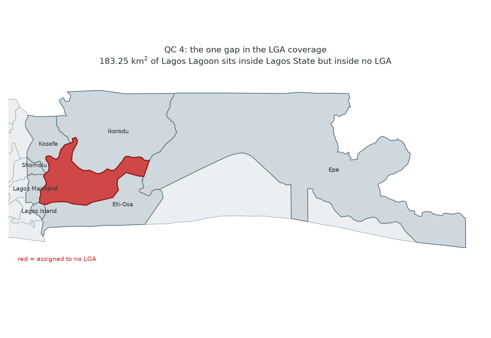

# Data preparation — Week 3

*Nigeria Malaria SNT Spatial Intelligence System. Written 20 September 2026.*

**What this week did:** reprojected the Week 2 layers to a working coordinate
system, clipped them to an explicit study area, ran five quality checks, and
wrote the result out as one analysis-ready GeoPackage.

**Where the analysis-ready file lives:**
[`data/processed/nga_snt_analysis_ready.gpkg`](../data/processed/nga_snt_analysis_ready.gpkg)
— 3.67 MB, committed, three layers, all in ESRI:102022.

| Layer | Features | Geometry | Attributes |
|---|---|---|---|
| `study_area` | 1 | MultiPolygon | 2 |
| `adm1_state` | 37 | MultiPolygon | 12 |
| `adm2_lga` | 774 | MultiPolygon | 26 |

Everything below is produced by
[`scripts/prepare_analysis_ready.py`](../scripts/prepare_analysis_ready.py), which
also writes the machine-readable
[`data/processed/qc_report.json`](../data/processed/qc_report.json). Re-run it and
every number on this page is regenerated:

```bash
python scripts/prepare_analysis_ready.py
```

---

## 1. The CRS, and why

**Working CRS: `ESRI:102022`, Africa Albers Equal Area Conic. Units metre.**
Source CRS was `EPSG:4326` (WGS 84 geographic), which is what the OCHA
Common Operational Dataset ships in.

Degrees are not a unit you can measure with. The primary question — *do
neighbouring LGAs carry different intervention mixes?* — becomes, once it is
quantified, a question about **shared border length** and about **how many
people live either side of a border**. Both need metres, and the population
one needs honest **area**, because population density is people per km².

Nigeria spans roughly 2.7° E to 14.7° E. That is **three UTM zones** (31N, 32N,
33N), so no single UTM zone covers the country without distorting its edges,
and the national Minna belts have the same problem for the same reason. I
tested the candidates by projecting all 774 LGAs and comparing each one's
projected area against its **geodesic area on the WGS 84 ellipsoid**, which is
the ground truth no projection can improve on:

| CRS | National total | vs geodesic | Worst single LGA | Mean abs error |
|---|---|---|---|---|
| **ESRI:102022 Africa Albers Equal Area** | **909,749.5 km²** | **−0.00001%** | **0.025%** | **0.0001%** |
| EPSG:26392 Minna / Nigeria Mid Belt | 911,597.6 km² | +0.203% | 1.00% | 0.194% |
| EPSG:32632 UTM zone 32N | 911,504.5 km² | +0.193% | 1.09% | 0.220% |
| EPSG:32631 UTM zone 31N | 918,362.8 km² | +0.947% | 3.88% | 0.686% |
| EPSG:32633 UTM zone 33N | 924,480.4 km² | +1.619% | 4.56% | 1.882% |

Geodesic ground truth: **909,749.6 km²**.

Albers is the only candidate that is right everywhere at once. A UTM zone is
more accurate than Albers *inside its own zone* and worse than useless outside
it — UTM 33N inflates the far west of Nigeria by 4.56%, which would have made
Kebbi and Sokoto LGAs look half again more sparsely populated than they are.

**The trade-off, stated plainly.** Albers is equal-area, not conformal, so it
preserves area exactly and distorts shape and distance slightly. Area is what
this project needs to be exact (density denominators), and the distance
measure it needs — shared border length between two LGAs that touch — is a
*local* measurement between adjacent polygons, where Albers' distortion over a
few tens of kilometres is far below the precision of the 2019 boundaries
themselves. If a later stage needs true distances at national range, that stage
reprojects for itself and says so.

`EPSG:4326` is kept as the **archival** CRS: `nga_cod_admin.gpkg` from Week 2 is
unchanged and still geographic, so nothing is lost and the reprojection is
reproducible from the source rather than baked in.

---

## 2. What was reprojected, and what was clipped

**Reprojected.** Both layers, `adm1_state` (37) and `adm2_lga` (774), from
EPSG:4326 to ESRI:102022. Attributes untouched.

**The study area.** The project's study area is Nigeria at LGA level, so the
study area *is* the union of the 774 LGAs. Rather than leave that implicit, the
script builds it: `study_area` = `adm2_lga.union_all()`, written out as its own
layer so every later stage clips to the same polygon instead of re-deriving it.
It measures **909,749.5 km²**.

**Clipped.** `adm1_state` and `adm2_lga` were both clipped to `study_area`.

| Layer | Features in | Features out | Area removed |
|---|---|---|---|
| `adm1_state` | 37 | 37 | **183.246 km²** |
| `adm2_lga` | 774 | 774 | 0.000 km² |

Clipping the LGA layer to its own union is the identity operation and removed
nothing, as it must — that is the check, not a formality: a non-zero result
there would have meant the union was wrong.

Clipping the **state** layer was not the identity operation, and that is how
the week's one real finding surfaced.

---

## 3. The five quality checks

### QC 1 — CRS and projection integrity

*Does every layer have a declared CRS, do they agree after reprojection, and
does the projection preserve the quantity the analysis depends on?*

| | Result |
|---|---|
| Layers with a declared source CRS | 2 of 2, both EPSG:4326 |
| Layers in ESRI:102022 after reprojection | 2 of 2 |
| National area, geodesic | 909,749.6 km² |
| National area, projected | 909,749.5 km² (**−0.00001%**) |
| Worst per-LGA area error | **0.0252%** |
| Mean absolute per-LGA area error | 0.00014% |

**Pass.** The full comparison against the rejected CRS candidates is in
section 1. The check is written to fail if the worst per-LGA error exceeds
0.5%, so swapping the working CRS for a bad one raises an alarm rather than
silently shifting every density figure.

### QC 2 — Geometry validity

*Is any geometry invalid, empty or null, before it is used in an overlay?*

| Layer | Features | Invalid | Empty | Null |
|---|---|---|---|---|
| `adm1_state` | 37 | **0** | 0 | 0 |
| `adm2_lga` | 774 | **0** | 0 | 0 |

**Pass, nothing to repair.** The check runs *after* reprojection, deliberately:
Week 2 validated these geometries in EPSG:4326, and a coordinate transform can
introduce a self-intersection that was not there before. It was not the case
here, but assuming it could not happen is how a bad polygon reaches an overlay.
Repair with `make_valid` is wired in and simply did not fire.

### QC 3 — Identity and completeness

*Did the reproject-and-clip round trip lose a feature or break a join key?*

| | Expected | Found |
|---|---|---|
| LGA features | 774 | **774** |
| Unique `adm2_pcode` | 774 | **774** |
| Null `adm2_pcode` | 0 | **0** |
| State features | 37 | **37** |
| Unique `adm1_pcode` | 37 | **37** |
| LGA state codes with no matching state | 0 | **0** |

**Pass.** Every LGA still carries a unique PCODE and every LGA's `adm1_pcode`
resolves to a state in the state layer, so the Week 2 774/774 join survives
Week 3 intact. This check raises rather than warns — a partial clip that
quietly dropped an island LGA would stop the build.

### QC 4 — Coverage topology: gaps and overlaps

*Do the 774 LGAs tile the country — no polygon overlapping another, no
unclaimed ground between them?*

| | Result |
|---|---|
| Candidate overlapping pairs found by spatial index | **0** |
| Overlaps above the 1,000 m² sliver tolerance | **0** |
| Sum of the 774 LGA areas | 909,749.512 km² |
| Area of the dissolved coverage | 909,749.512 km² |
| Double-counted area | **0.000 km²** |
| Interior holes in the dissolved coverage | **1** |
| Largest hole | **183.246 km²** |

**Overlaps: pass. Gaps: one, and it matters.** No two LGAs overlap anywhere,
and the sum of the parts equals the whole to three decimal places, so nothing
is double-counted. But the coverage has a hole — see section 4.

### QC 5 — Attribute domains and nulls

*Are the analysis columns still in their expected value domains, and is every
null a known one?*

| Column | Classes | Counts |
|---|---|---|
| `intervention_mix` | 7 of 7 | IPTi+LLINs 319, SMC+PBO 258, SMC+LLINs 106, IPTi+Urban 43, IPTi+PBO 24, SMC+Urban 19, Urban only 5 |
| `net_type` | 3 of 3 | LLINs 425, PBO-LLINs 282, UrbanLLINs 67 |
| `chemoprevention` | 3 of 3 | IPTi 386, SMC 383, none 5 |
| `match_method` | 3 of 3 | exact 746, spelling_table 16, suffix_strip 12 |
| `iccm` | 2 of 2 | No iCCM 762, iCCM 12 |

Nulls, all three of them known and none new:

| Column | Nulls | Why |
|---|---|---|
| `city` | 707 | not a missing value — the field only applies to the 67 urban-net LGAs |
| `pop_total_2020` | 1 | Bakassi |
| `pop_u5_2020` | 1 | Bakassi |

Population carried through unchanged: **204,909,220** total, **32,207,346**
under five. Identical to Week 2, so the reprojection moved no attribute.

**Pass.** Every class count matches Week 2 exactly. The check is written
against expected class *counts*, so a silent re-coding — a stray whitespace
splitting `LLINs` into two classes, say — fails it.

---

## 4. Problems found, and what was done about each

Three entries, none blocking. All three are in `qc_report.json` under
`problems`, each with the action taken.

### 4.1 Lagos Lagoon belongs to no LGA — **flagged, not filled**



**What was found.** The dissolved LGA coverage has exactly one interior hole:
**183.246 km²** at 3.39–3.64 E, 6.46–6.60 N, ringed by seven Lagos LGAs — Epe,
Eti-Osa, Ikorodu, Kosofe, Lagos Island, Lagos Mainland and Shomolu. It is
**Lagos Lagoon**.

The COD **state** polygon for Lagos includes the lagoon; the **LGA** polygons
do not. That is why clipping `adm1_state` to the LGA union removed 183.246 km²
— the same number, to three decimals, which is what confirms the two facts are
one fact:

```
Lagos State polygon      3,671.476 km2
sum of its 20 LGAs       3,488.230 km2
difference                 183.246 km2   = the lagoon
```

**Why it is not cosmetic.** The primary question is about what happens at the
border between two neighbouring LGAs. A polygon-contiguity neighbour list —
the standard queen or rook rule — asks whether two polygons *touch*. Across
the lagoon, they do not: the water sits between them. **14 pairs of Lagos
shore LGAs fail to be neighbours for that reason alone**, and four of those
pairs carry **different** intervention mixes:

| | | |
|---|---|---|
| Epe × Kosofe | `CM+IPTp+LLINs+IPTi` | vs `CM+IPTp+UrbanLLINs+IPTi` |
| Epe × Lagos Island | `CM+IPTp+LLINs+IPTi` | vs `CM+IPTp+UrbanLLINs+IPTi` |
| Epe × Lagos Mainland | `CM+IPTp+LLINs+IPTi` | vs `CM+IPTp+UrbanLLINs+IPTi` |
| Epe × Shomolu | `CM+IPTp+LLINs+IPTi` | vs `CM+IPTp+UrbanLLINs+IPTi` |

Those are net-type frontiers — standard LLINs on one shore, urban LLINs on the
other — and they are exactly the kind of boundary this project exists to count.
A naive contiguity build would drop all four without saying so.

**Decision: flagged, not filled.** Filling the hole would mean assigning
lagoon water to LGAs, and nothing in the source says which LGA owns which part
of it. That would be inventing data to make a topology tidy. The hole stays,
recorded here and in `qc_report.json`, and the Week 4 adjacency build carries
an explicit ruling for it rather than inheriting a silent one.

**What the clip did do:** `adm1_state` is now clipped to the LGA coverage, so
the two layers cover exactly the same ground in the analysis-ready file. State
totals computed from the state layer and from summing its LGAs now agree.

### 4.2 The state and LGA layers did not cover the same ground — **fixed**

Recorded separately because it is the same discrepancy seen from the other
side. Before the clip, a national total taken from `adm1_state` was 183.246 km²
larger than the same total taken from `adm2_lga`. After the clip they are
identical. **Fixed by the clip**; no attribute was changed.

### 4.3 Bakassi has no population — **carried forward, still flagged**

Known from Week 2 and unchanged: Bakassi (`NG009005`, Cross River) was ceded to
Cameroon under the 2002 ICJ ruling and was never enumerated, so it is drawn but
not counted. It is the one LGA with a null `pop_total_2020`.

**Kept, not dropped.** Deleting it would break the 774 count and the
intervention geography; imputing it would invent a population. Any per-capita
measure must exclude it explicitly, and the new `pop_density_2020` column is
null for Bakassi rather than zero, so it propagates as missing instead of
silently reading as an empty LGA.

---

## 5. What is in the analysis-ready file

`data/processed/nga_snt_analysis_ready.gpkg`, ESRI:102022:

- **`study_area`** — 1 MultiPolygon, 909,749.5 km². Clip every later layer to
  this rather than re-deriving the boundary.
- **`adm1_state`** — 37 features. Clipped to the study area, so it now agrees
  with the LGA layer. New column: `area_km2_albers`.
- **`adm2_lga`** — 774 features, 26 attributes. The COD identifiers, the
  intervention columns (`intervention_mix`, `net_type`, `chemoprevention`,
  `iccm`, `city`), the Week 2 provenance columns (`match_method`,
  `source_page`), population (`pop_total_2020`, `pop_u5_2020`), and two new
  ones computed in the working CRS: **`area_km2_albers`** and
  **`pop_density_2020`** (people per km², null for Bakassi).

Open it directly in QGIS, or:

```python
import geopandas as gpd
lga = gpd.read_file("data/processed/nga_snt_analysis_ready.gpkg", layer="adm2_lga")
```

---

## What comes next

The data are now in metres, tiled without overlap, and carry an area column
that is right to 0.03%. Week 4 builds the LGA adjacency list from these
polygons and counts how often two neighbours differ on `net_type` or
`chemoprevention` — the answer to the primary question.

It starts with the ruling 4.1 leaves open: whether two LGAs facing each other
across Lagos Lagoon count as neighbours. Both answers are defensible; the point
is that it will be recorded as a decision rather than inherited from whatever
`libpysal` happens to do with a hole.
